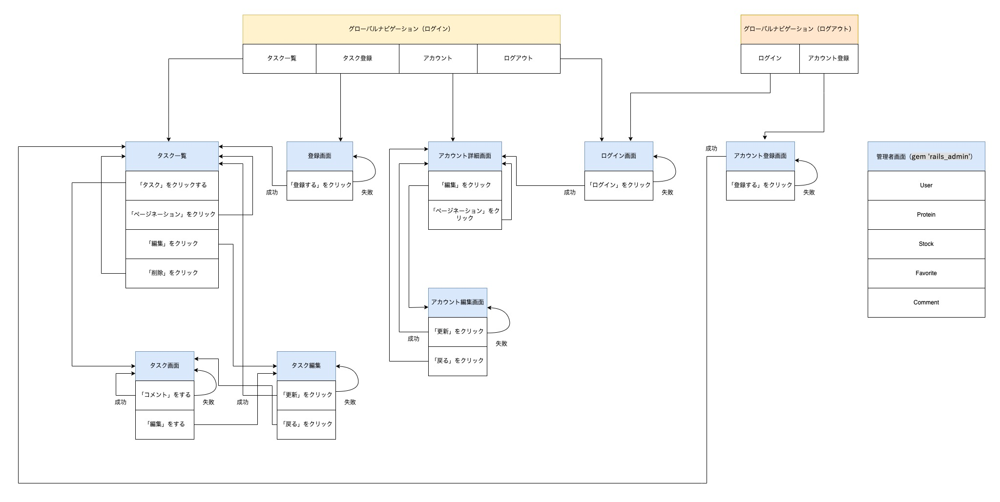

<h1>README</h1>

# <h2>開発言語</h2>

・Ruby 3.0.1

・Ruby on Rails 6.0.3

# <h2>就業Termの技術</h2>

・お気に入り機能

・devise

# <h2>カリキュラム外の技術</h2>

・bootstrap_form

# <h2>実行手順</h2>

    $ https://github.com/cclemon3248/protein.git
    $ cd protein
    $ bundle install
    $ rails db:create && rails db:migrate
    $ rails s

# <h2>カタログ設計</h2>

https://docs.google.com/spreadsheets/d/1dYa7NJg0YysYZa8V0XR7CuPUwK8IkWnYtZwa_dcFmKY/edit?usp=sharing

# <h2>テーブル定義書</h2>

https://docs.google.com/spreadsheets/d/1dYa7NJg0YysYZa8V0XR7CuPUwK8IkWnYtZwa_dcFmKY/edit?usp=sharing

# <h2>ワイヤーフレーム</h2>

https://drive.google.com/file/d/15DRb_OdrHqPvoApjUI66pW214PQAWXSI/view?usp=sharing

# <h2>ER図</h2>

# <h2>画面遷移図</h2>

